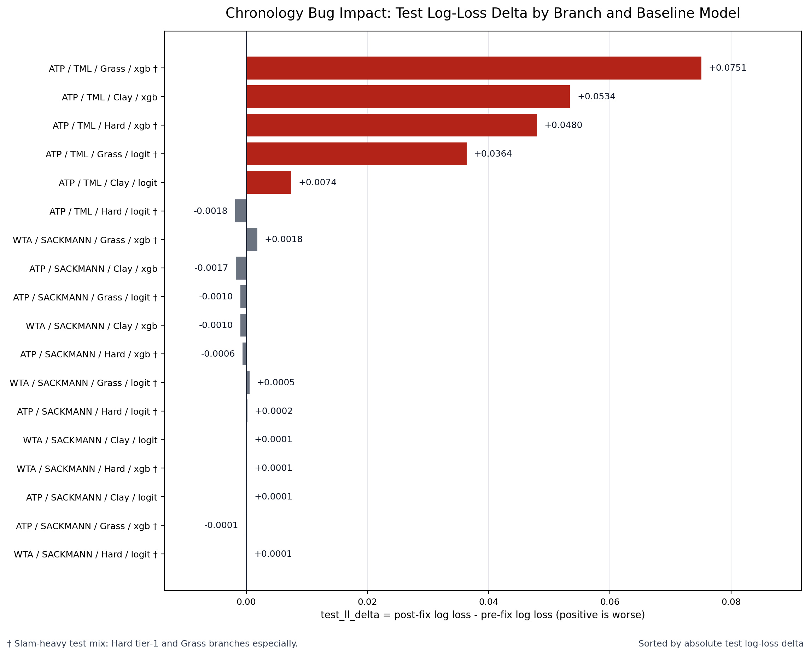

# Day 2 Remediation: Chronology-Bug Impact Across Branches

The chronology fix barely moved the Sackmann branches: every Sackmann baseline changed by less than 0.002 log-loss, and most were effectively unchanged. The bug was concentrated in ATP/TML, especially XGBoost: ATP/TML/Grass XGB regressed by +0.0751 log-loss and -6.89 accuracy points, ATP/TML/Clay XGB by +0.0534 log-loss and -7.19 points, and ATP/TML/Hard XGB by +0.0480 log-loss and -3.17 points. ATP/TML/Grass logistic also moved materially (+0.0364 log-loss), while ATP/TML/Hard logistic and all WTA/Sackmann rows barely moved.

| tour | source | surface | model | test_ll_pre_fix | test_ll_post_fix | test_ll_delta | test_acc_pre_fix | test_acc_post_fix | test_acc_delta | test_rows |
| --- | --- | --- | --- | --- | --- | --- | --- | --- | --- | --- |
| atp | sackmann | Hard | logit_baseline | 0.604400 | 0.604578 | 0.000178 | 0.652400 | 0.651843 | -0.000557 | 1709 |
| atp | sackmann | Hard | xgb_baseline | 0.661700 | 0.661081 | -0.000619 | 0.660000 | 0.665301 | 0.005301 | 1709 |
| atp | sackmann | Clay | logit_baseline | 0.614100 | 0.614220 | 0.000120 | 0.656200 | 0.656151 | -0.000049 | 951 |
| atp | sackmann | Clay | xgb_baseline | 0.618100 | 0.616384 | -0.001716 | 0.646700 | 0.646688 | -0.000012 | 951 |
| atp | sackmann | Grass | logit_baseline | 0.597300 | 0.596310 | -0.000990 | 0.669800 | 0.669841 | 0.000041 | 315 |
| atp | sackmann | Grass | xgb_baseline | 0.582800 | 0.582681 | -0.000119 | 0.695200 | 0.692063 | -0.003137 | 315 |
| atp | tml | Hard | logit_baseline | 0.617800 | 0.615963 | -0.001837 | 0.650300 | 0.641223 | -0.009077 | 3629 |
| atp | tml | Hard | xgb_baseline | 0.586100 | 0.634054 | 0.047954 | 0.685600 | 0.653899 | -0.031701 | 3629 |
| atp | tml | Clay | logit_baseline | 0.616100 | 0.623543 | 0.007443 | 0.650800 | 0.643463 | -0.007337 | 1767 |
| atp | tml | Clay | xgb_baseline | 0.571800 | 0.625207 | 0.053407 | 0.705700 | 0.633843 | -0.071857 | 1767 |
| atp | tml | Grass | logit_baseline | 0.580200 | 0.616569 | 0.036369 | 0.695500 | 0.661859 | -0.033641 | 624 |
| atp | tml | Grass | xgb_baseline | 0.535700 | 0.610771 | 0.075071 | 0.726000 | 0.657051 | -0.068949 | 624 |
| wta | sackmann | Hard | logit_baseline | 0.610600 | 0.610673 | 0.000073 | 0.658800 | 0.660144 | 0.001344 | 1533 |
| wta | sackmann | Hard | xgb_baseline | 0.613800 | 0.613933 | 0.000133 | 0.652300 | 0.647750 | -0.004550 | 1533 |
| wta | sackmann | Clay | logit_baseline | 0.592500 | 0.592644 | 0.000144 | 0.681200 | 0.682652 | 0.001452 | 709 |
| wta | sackmann | Clay | xgb_baseline | 0.600000 | 0.599037 | -0.000963 | 0.667100 | 0.658674 | -0.008426 | 709 |
| wta | sackmann | Grass | logit_baseline | 0.647000 | 0.647533 | 0.000533 | 0.618100 | 0.628472 | 0.010372 | 288 |
| wta | sackmann | Grass | xgb_baseline | 0.636000 | 0.637834 | 0.001834 | 0.621500 | 0.611111 | -0.010389 | 288 |

## What this means for previous reports

The 29-feature comparison report's Sackmann conclusions survive: the 29-feature pipeline did not materially change ATP/Sackmann or WTA/Sackmann baseline performance, and the small branch-to-branch movements there remain defensible. Its ATP/TML conclusions do not survive: the apparent TML XGB strength was mostly chronology leakage, with corrected baseline log-loss now 0.6341 on Hard, 0.6252 on Clay, and 0.6108 on Grass instead of the reported 0.5861, 0.5718, and 0.5357. The days 3-5 report's engineering conclusions survive: the dependency/test cleanup, the repaired Elo test, the stronger logistic CV protocol, and the finding that isotonic calibration is risky on small validation branches are still valid. Its performance conclusions for ATP/TML do not survive: claims that ATP/TML/Grass XGB reached 72.6% accuracy and 0.543 test log-loss, that TML XGB was the strongest surface-specific result, and that the TML branch wins were model improvements rather than leakage must be withdrawn until tuned variants are rerun under the corrected chronology protocol.
